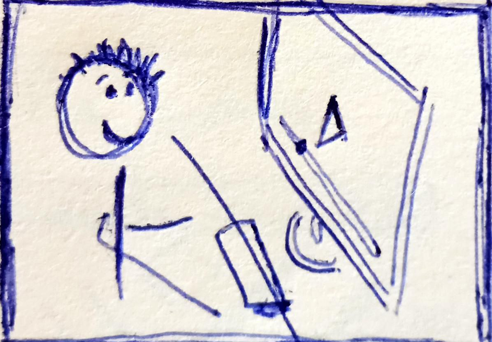

# SnipVocab Arabic

Learn spoken Arabic by watching videos — and learning just the words you need for each video!

## User Stories

### As a learner, I want to watch and understand interesting Arabic videos from day 1



### As a learner, I want to learn to communicate in Arabic 


### As a learner, I want to integrate the app into my long-term Arabic study routine


### As a learner, I do not want to be bored or frustrated


## Tech
### Tech Stack 

- typescript
- Vue3
- Vite
- Tailwind
- Daisy
- Supabase
- ts-fsrs
- a little bit of python
- are we mentioning Cursor AI here?

### Running it Locally

- clone the repo and navigate to the folder
- run this:

```
npm i
npm run dev
```